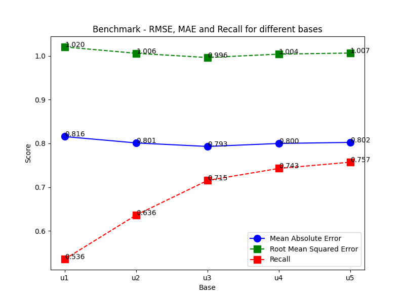

# Author

- Name: Arsen Mutalapov
- Email: [a.mutalapov@innopolis.university](a.mutalapov@innopolis.university)
- Group: BS21-DS02

## Required libraries

- Light: numpy, pandas, matplotlib, tqdm, scipy, scikit-learn, gensim, nltk
- Heavy: networkx, torch, torch_geometric

## Benchmark

### Arguments

- **testset**: comma separated list of base sets = [u1, u2, u3, u4, u5, ua, ub]
- **k**: number of top items to recommend = 10
- **liked_rating**: optional = 4 (default)

### Run benchmark

```bash
!python ./benchmark/evaluate.py u1,u2,u3,u4,u5 10

### Output
# Base: u1. Avg recall: 0.535577
# Base: u2. Avg recall: 0.636331
# Base: u3. Avg recall: 0.715343
# Base: u4. Avg recall: 0.742827
# Base: u5. Avg recall: 0.757044
# Mean recall on different dataset parts: 0.6774

```

## Result


