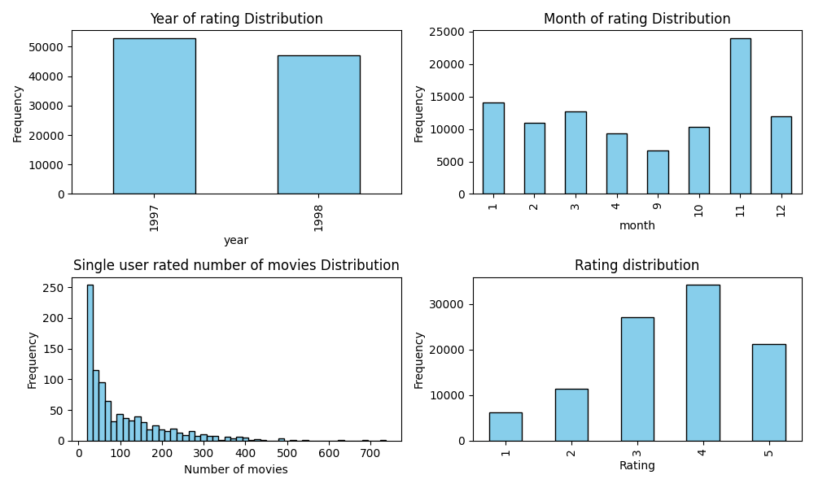
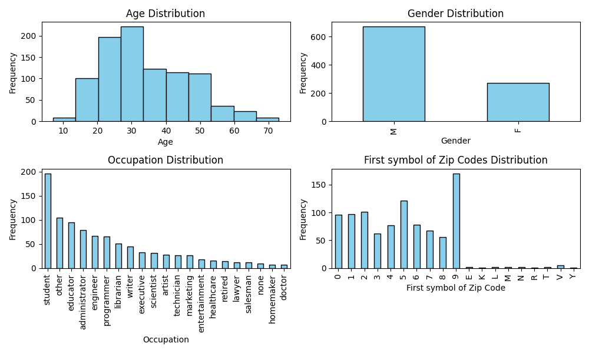
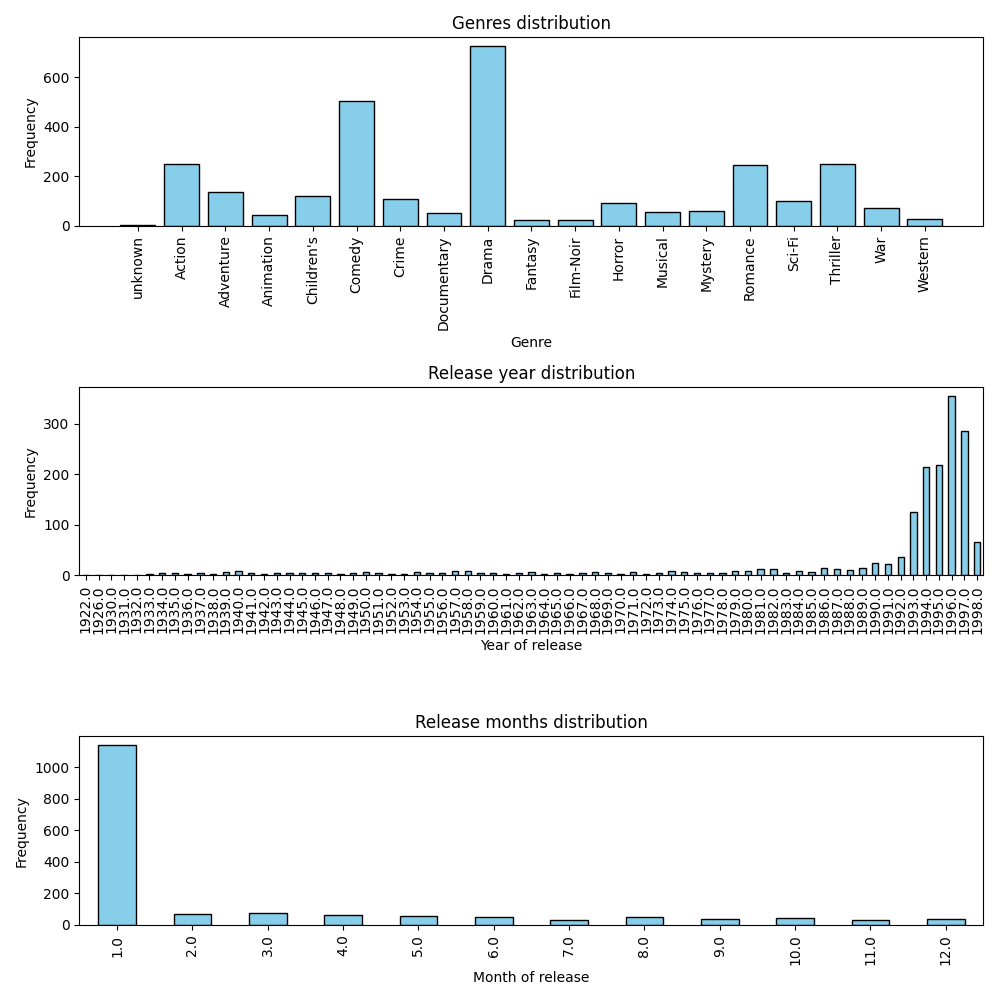

# Report for Movie Recommender System Assignment

## Data analysis and exploration

### Visualizations

- Ratings info distribution: 
- Users info distribution: 
- Movies info distribution: 

### Preprocessing

I used the following preprocessing steps:

- Extract month and year from timestamp
- Extract first symbol from zip_code
- Extract number of days from release date. I counted from the most recent date in the dataset.
- Drop video release date and imdb url
- Remove punctuation and digits from movie title
- I one hot encode all categorical features: genres, occupation, region, gender
- MinMax scale all numerical features: age, days from release date, month, year, rating
- Title embeddings were untauched float features


### Conclusions from data analysis

I can draw the following conclusions from the data analysis:

- All video release dates are null
- zipcodes are quite evenly distributed but there are weird wrong ones that start with E,K,L,M,M,R,T,V,Y
- users are usually student but the mode age is 30. Users are usually men as well.
- users mostly prefer November to watch or rate movies
- dataset is unbalanced towards the good rating (4-5)
- genres are unbalanced towards drama, comedy, actions
- almost all the films were released at January
- the years of release are very widespread but has a huge cluster aroun 1996

## Details of Model Implementation

I used Random Forest Regressor to predict ratings for movies. The model was trained on the following features:

- Title embeddings - 50 features. I extracted words that are more than 3 symbols and then used nltk for get embeddings for each word. Then I averaged all the embeddings for each movie title.
- From timestamp: year, month, day. 
- User info: age, occupation, first symbol in zip_code which means the whole region.
- Film genre
- Label - rating

## Model Advantages and Disadvantages

Advantages of Random Forest Regressor for recommender systems:

- It is easy to use and understand
- Fast to train
- It is robust to outliers, can handle missing and categorical values
- large datasets and high dimensional data

Disadvantages of Random Forest Regressor for recommender systems:

- It is prone to overfitting
- It provides not so accurate results
- It is not suitable for real-time predictions, for linear relationships and for small datasets

## Training Process

I used simple interface from sklearn to train the model. The code is shown below:

```python
from sklearn.ensemble import RandomForestRegressor

model = RandomForestRegressor(n_estimators=100, random_state=123)
model.fit(X_train, y_train)
```

Random state is used to make the results reproducible.

## Evaluation

The approach was tested on different test sets (u1..u5, ua, ub). The model were predicting ratings on unknown pairs (movie-user) and then RMSE and MAE were calculated for each test set. The results are shown in the table below.

Also, the recall was calculated as following: for each user in the test set, the model was predicting ratings for all movies that a user has rated but the model was not trained on them. Then the top 10 movies were selected. If the user liked a movie (rating >= 4), then the hit number was increased by 1. After it, the recall was calculated as the number of hits divided by the number of liked movies of a user. This was checked for all users in the test set and the average recall was calculated.

## Results

Benchmark scores on test sets of u1, u2, u3, u4, and u5 for k=10 and liked when rating >= 4:

| Dataset | RMSE | MAE | Recall |
| ------- | ---- | --- | ------ |
| u1      | 1.020 | 0.816 | 0.536 |
| u2      | 1.006 | 0.801 | 0.636 |
| u3      | 0.996 | 0.793 | 0.715 |
| u4      | 1.004 | 0.800 | 0.743 |
| u5      | 1.007 | 0.802 | 0.757 |
